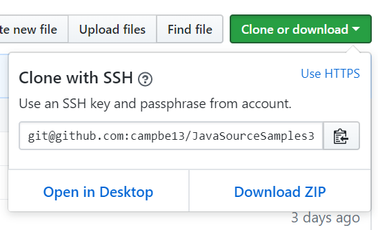

# 360-420-DW 2018 [Dawson College](http://www.dawsoncollege.qc.ca)
This workspace is for all code used for
teaching Introductory Java to Science students

The [fromslides/S01 through S17](fromslides/) directories correspond to 
the Slide decks for lecture slides which are available on moodle. 

You can read the files directly from the git server interface,  you can copy them individually, 
use the raw format if you do so. Or you can download everything, on the main page there is a button to download as a zip file: 
## compiling
First Install the JRE & JDK and [Dr. Java](http://www.drjava.org/)
Use Dr java to compile & run.  The UI is fairly simple to use.
### command line compile
compile to create the bytecode, .class file
```bash
tricia@acerubuntu1804:~/simple-java$ javac FileName.java 
tricia@acerubuntu1804:~/simple-java$ ls 
FileName.class  FileName.java
```
run
```
tricia@acerubuntu1804:~/simple-java$ java FileName
Hello World!  from Java
```
## clone the repo
If you are game install git and clone the whole repo, open a command prompt:
```bash
git clone https://github.com/campbe13/JavaSourceSamples360.git
```
Windows or OS X first install git bash: https://git-scm.com/downloads

## LIcense
This code is [licensed under Apache 2.0](LICENSE.txt) The code here is written as examples
and is stripped down in  order to illustrate specific objectives for teaching. 
Therefore there may be missing components that would normally be included. 

That being said any mistakes are my own, please email me at pcampbell . edu @ gmail . com
should you wish to notify me of a mistake. 


## For Teachers
* short url for this repo http://bit.ly/java360
* full url  https://github.com/campbe13/JavaSourceSamples360
* Cloud9 https://ide.c9.io/pcampbelldawson/samples360
